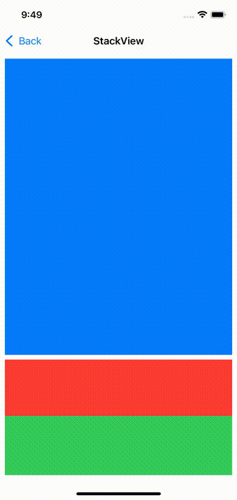

# Sticky Element Demo

Showcases a way to make an element sticky inside a UIScrollView.

The project includes both a raw Auto Layout setup as well as a UIStackView setup.

## How to achieve this

The main trick is the same. A placeholder view is positioned in the view heirachy
where the sticky view should be, and it is told to match the size of the sticky view.

The sticky view is then told to sit in the center of the placeholder view, but
with a non-required priority.

The sticky view is also told to be aligned between the top and the bottom of the
containing UIScrollView. This means that when the view would be scrolled out,
the top- and bottom-constraints will hit their limit and break the center-constraint.

In this recording, the green square is the sticky square:

Having the view stick to either only top or bottom is very simple: Just remove
the constraint for the other end.
